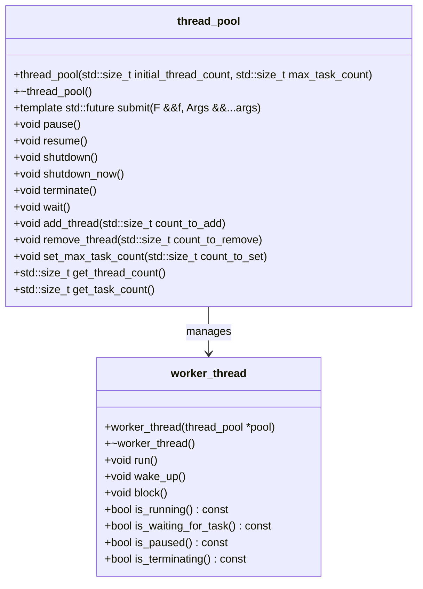
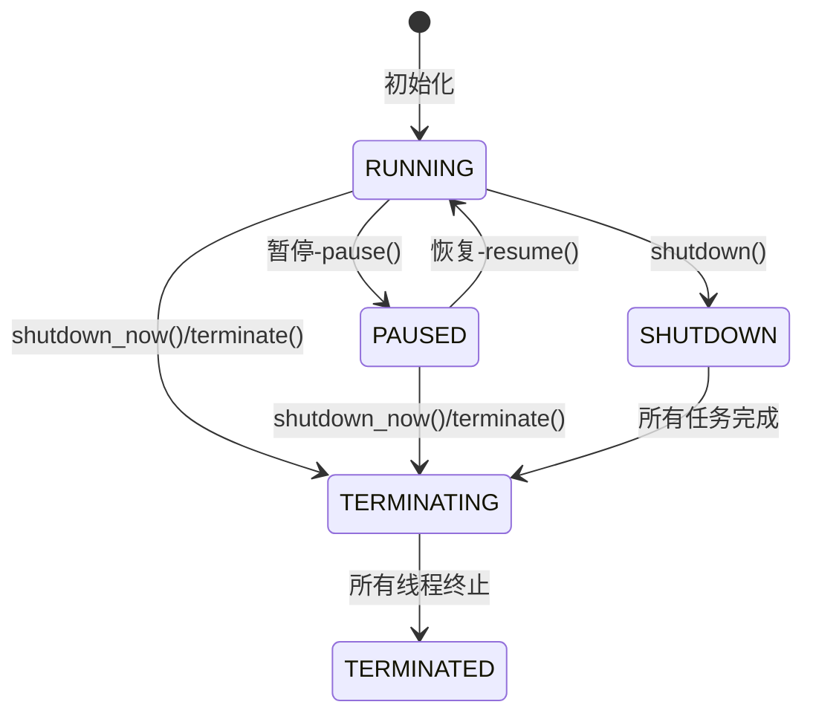
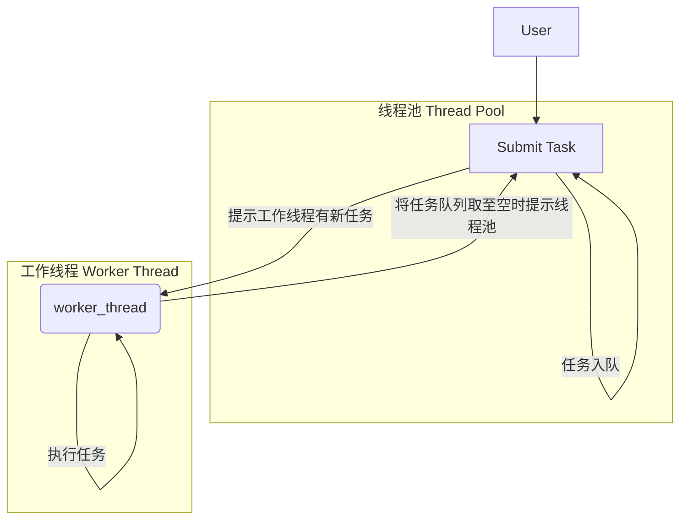
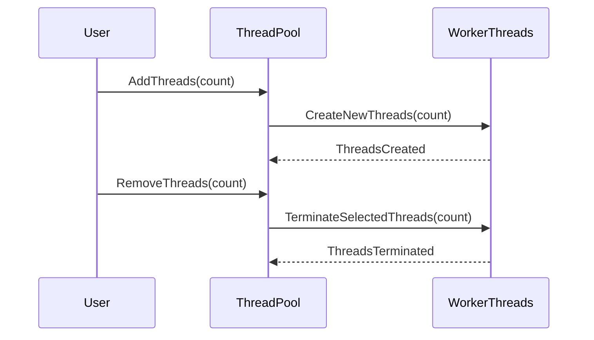

# 揭秘C++线程池库：设计、实现与应用

在现代软件开发中，多线程编程已经成为提高应用程序性能、实现并发任务处理的重要手段。然而，直接管理多个线程往往伴随着复杂性增加、资源浪费和同步问题。为了解决这些问题，线程池作为一种有效的线程管理机制应运而生。线程池预先创建一组工作线程，将待执行任务提交到线程池，由池内线程负责任务的分配与执行，从而简化线程管理、减少系统开销并提高资源利用率。

本文将详细介绍一个精心设计的C++线程池库，它不仅提供了简洁易用的接口供开发者高效地提交并行任务，还具备动态调整线程数、限制任务队列容量、优雅关闭等丰富特性。我们将深入剖析库的架构设计、关键类与接口、实现细节，以及如何在实际项目中应用这个线程池库来提升系统的并发处理能力。

## **线程池的优势**

### **资源管理与性能优化**

- **避免频繁创建与销毁线程**：线程池预先创建并维护一定数量的工作线程，避免了频繁创建和销毁线程带来的系统开销，特别是在处理大量短生命周期任务时，效果尤为显著。
- **均衡负载与缓存局部性**：线程池可以根据任务负载动态调整线程工作状态，避免过度竞争和闲置。同时，线程在执行任务过程中可以充分利用CPU缓存，提高执行效率。
- **控制并发级别**：通过限制线程池大小和任务队列容量，可以有效控制系统的并发级别，防止因过度并发导致的资源争抢和性能下降。

### **简化编程模型**

- **统一任务提交接口**：线程池提供统一的接口供开发者提交任务，无需关心线程创建、同步等底层细节，降低了多线程编程的复杂度。
- **异常处理与任务取消**：线程池通常支持异常处理机制和任务取消功能，使得在出现异常情况或需求变更时，可以更方便地管理和调整任务执行。

## **项目背景与目标**

随着并发编程需求的增长，我们发现市场上虽已有不少线程池库，但在易用性、灵活性、性能等方面存在不足。为了满足更广泛的应用场景和更高的性能要求，我们决定开发一个定制化的C++线程池库。该库旨在：

1. **提供简洁高效的API**：设计直观易用的接口，使开发者能够轻松地提交、管理并行任务。
2. **支持动态线程调整**：允许根据任务负载动态增加或减少工作线程数量，实现资源的精细化管理。
3. **具备丰富的控制选项**：包括限制任务队列容量、优雅关闭线程池等，赋予用户对线程池行为的精细控制权。
4. **兼顾性能与稳定性**：通过合理的设计与优化，确保在各种负载下库的高性能表现，并妥善处理异常情况，保障程序稳定运行。

接下来，我们将深入探讨这个C++线程池库的设计思想、实现细节以及如何将其应用于实际项目中。无论您是寻求提高现有项目并发能力的开发者，还是对线程池技术感兴趣的读者，相信都能从中获得有价值的见解和实用知识。

## II. 设计概览

### **库架构**

本C++线程池库采用了模块化设计，主要由以下几个核心组件构成：

1. **`thread_pool`类**：作为用户直接交互的接口，负责任务调度、线程管理等核心功能。用户通过创建`thread_pool`实例提交任务，控制线程池状态，并获取线程池相关信息。

2. **`worker_thread`类**：作为线程池内部的工作单元，每个`worker_thread`对象代表一个独立的工作线程，负责从任务队列中取出任务并执行。尽管`worker_thread`类是库的内部实现细节，了解其工作机制有助于深入理解线程池整体运作。

3. **辅助工具**：包括同步原语（如互斥锁、条件变量、信号量等）以及状态管理机制，它们为线程池和工作线程之间的通信、任务同步、状态变更等操作提供了必要的支撑。

各组件间的关系如下：

- `thread_pool`类维护一个工作线程列表（`worker_thread`对象集合），并通过同步原语控制任务队列的访问与状态变更。
- `worker_thread`类通过与`thread_pool`对象的交互，获取待执行任务、更新自身状态，并响应来自`thread_pool`的指令（如暂停、恢复、终止等）。
- 辅助工具贯穿于整个库的设计与实现中，确保并发环境下的数据一致性与操作安全性。

### **关键类与接口**



#### **`thread_pool`类**

**功能定位**：`thread_pool`类是用户与线程池库交互的主要入口，封装了线程池创建、任务提交、状态控制、属性调整与信息获取等核心功能。

**主要API**：

- **构造函数**：接受初始工作线程数和最大任务队列容量作为参数，创建并初始化线程池。

- **任务提交**：提供模板方法`submit`，接受可调用对象（如函数、lambda表达式）及参数，将其封装为任务提交至任务队列，并返回一个`std::future`对象，用于获取任务执行结果。

- **线程池控制**：
  - **`pause`**：暂停线程池，阻止新任务的执行并暂停当前运行的任务。
  - **`resume`**：恢复线程池的运行，继续处理队列中的任务。
  - **`shutdown`**：设置线程池为等待任务完成状态，等待所有已提交任务执行完毕后终止线程池。
  - **`shutdown_now`**：立即终止线程池，丢弃任务队列中的未处理任务。

- **属性调整与信息获取**：
  - **`add_thread`**：动态向线程池添加工作线程。
  - **`remove_thread`**：从线程池中移除指定数量的工作线程。
  - **`set_max_task_count`**：限制任务队列中允许的最大任务数量。
  - **`get_thread_count`**：查询当前线程池中活动的工作线程数。
  - **`get_task_count`**：查询等待执行的任务数量。

#### **`worker_thread`类（内部实现）**

**功能定位**：`worker_thread`类是线程池内部的工作单元，负责从任务队列中取出任务并执行。其状态机模型、任务循环逻辑以及响应线程池指令的方式直接影响线程池的性能与稳定性。

**内部状态与行为**：

- **状态机**：`worker_thread`对象具有多种状态（如运行、暂停、等待任务、将终止、已终止等），通过状态机模型管理状态变迁。
- **任务循环**：每个工作线程在一个无限循环中，根据自身状态执行相应操作，如从任务队列取任务、执行任务、响应线程池指令（如暂停、恢复、终止）等。
- **响应指令**：通过监听线程池状态变更信号和条件变量，`worker_thread`能够及时响应来自`thread_pool`的指令，调整自身状态并执行相应操作。

---

至此，我们已经对C++线程池库的设计概览有了全面的认识，接下来我们将深入剖析其实现细节，揭示其背后的工作机制与优化策略。

## III. 实现细节剖析

### **线程池核心机制**

#### **任务队列**

**数据结构选择**：任务队列采用`std::queue`实现，它是一种先进先出（FIFO）的数据结构，符合线程池任务调度的基本原则——按提交顺序依次执行。

**同步机制**：

- **互斥锁**：使用`std::shared_mutex`保护任务队列的访问，确保在多线程环境下对任务队列的操作是线程安全的。读取任务队列状态（如查询任务数量）时使用`std::shared_lock`，仅需读取权限；向队列添加或移除任务时使用`std::unique_lock`，需要独占访问权限。

- **条件变量**：使用`std::condition_variable_any`协调线程间的同步。当任务队列为空时，等待任务的线程会被阻塞，直到有新任务入队或线程池状态发生改变时，通过条件变量唤醒等待的线程。

#### **工作线程管理**

**创建与销毁**：在`thread_pool`构造函数中创建指定数量的工作线程，并将它们加入工作线程列表。线程池析构时，通过调用`worker_thread`的`terminate`方法终止所有工作线程，并等待其退出。

**状态切换**：

- **线程状态**：使用`std::atomic`存储线程状态，确保在多线程环境下状态变更的原子性。

- **同步原语**：
  - **互斥锁**：保护线程状态的访问，确保状态变更操作的原子性。
  - **条件变量**：用于工作线程等待任务、响应线程池指令等场景，实现线程间的同步。
  - **信号量**：在`worker_thread`类中使用`std::binary_semaphore`实现线程的暂停与恢复。

#### **线程池状态机**



**状态枚举定义**：定义了如`RUNNING`、`PAUSED`、`SHUTDOWN`等状态枚举值，用于表示线程池的不同运行状态。

**状态变更操作**：

- **原子性保证**：通过在状态变更操作前后加锁解锁`status_mutex`，确保状态变更的原子性。

- **并发安全性**：在状态变更时，通过检查当前状态并相应地调整线程池及工作线程的行为，确保在并发环境下的正确性与一致性。

### **任务调度与执行**



#### **任务提交**

**`submit`方法实现**：

1. **模板函数包装**：接受可调用对象（如函数、lambda表达式）及参数，利用模板参数推导，将任务及其参数封装为一个无参的`std::function<void()>`。

2. **任务封装**：使用`std::packaged_task`将任务包装为可获取异步结果的对象，并通过其`get_future`方法获取一个`std::future`，用于后续获取任务执行结果。

3. **入队**：在确保线程池状态稳定的前提下，将任务放入任务队列，并通过条件变量通知等待任务的工作线程。

#### **工作线程任务循环**

**逻辑流程**：

1. **获取任务**：在循环中，工作线程首先检查线程池状态，根据状态决定是否继续执行任务或进行其他操作（如暂停、等待任务、终止等）。

2. **执行任务**：从任务队列中取出任务并执行。如果任务执行过程中抛出异常，捕获并记录异常信息，然后继续处理下一个任务。

3. **等待新任务**：当任务队列为空时，工作线程进入等待状态，直到有新任务入队或线程池状态变化时被唤醒。

4. **响应线程池指令**：根据线程池状态变更，如接收到暂停、恢复、终止等指令，工作线程调整自身状态并执行相应操作。

---

至此，我们已经详细剖析了C++线程池库的实现细节，包括线程池核心机制、任务调度与执行等关键环节。接下来我们将探讨库的特性与优化措施，以及如何在实际项目中应用这个线程池库。

## IV. 库特性与优化

### **动态线程调整**



**`add_thread`与`remove_thread`方法**：

- **实现**：这两个方法允许用户在运行时动态调整线程池中的工作线程数量。`add_thread`创建新的`worker_thread`对象并加入工作线程列表，`remove_thread`则选择适当的工作线程终止并从列表中移除。

- **使用场景**：在任务负载变化较大或需要针对特定硬件资源进行优化时，动态调整工作线程数有助于保持良好的系统性能。例如，当任务数量激增时，增加工作线程可以充分利用多核处理器，提高任务处理速度；反之，在任务稀疏时减少工作线程，可避免资源浪费和过度竞争。

**性能影响分析**：

- **积极影响**：动态调整线程数有助于适应负载波动，避免线程过多导致的上下文切换开销和资源争抢，或线程过少导致的处理器利用率低下。

- **注意事项**：频繁调整线程数可能导致性能波动和额外开销。应根据实际应用需求和监控数据，适度、适时地调整线程数，以达到最佳性能平衡。

#### **任务队列容量限制**

**`set_max_task_count`方法**：

- **实现**：该方法用于设置任务队列允许的最大任务数量。当任务队列接近或达到最大容量时，新提交的任务将被拒绝，返回一个错误提示。

- **应用场景**：在处理高优先级任务或资源有限的场景下，限制任务队列容量有助于避免低优先级任务积压，确保高优先级任务得到及时处理。此外，也可以通过调整任务队列容量来控制系统的内存使用，防止因任务堆积导致的内存溢出。

**拒绝策略**：

- **抛出异常**：当任务队列满且新任务被拒绝时，`submit`方法抛出`std::runtime_error`异常，通知调用者无法提交任务。

### **线程池优雅关闭与即时终止**

**`shutdown`与`shutdown_now`方法**：

- **优雅关闭**：`shutdown`方法将线程池设置为等待任务完成状态，允许已提交的任务继续执行，但不再接受新任务。所有任务完成后，线程池自动终止。

- **即时终止**：`shutdown_now`方法立即停止线程池，丢弃任务队列中的未处理任务，工作线程立即结束执行。

**资源清理与完整性**：

- **资源释放**：在终止线程池时，确保所有工作线程被正确地终止并等待其退出，同时清理相关资源，如释放互斥锁、条件变量等。

- **任务完整性**：使用`shutdown`方法可以保证所有已提交任务得到完整执行，适用于需要保证任务结果的场景；而`shutdown_now`适用于紧急情况或测试环境，可能牺牲部分未完成任务的完整性。

---

至此，我们已经详细介绍了C++线程池库的特性与优化措施，包括动态线程调整、任务队列容量限制、线程池优雅关闭与即时终止等。接下来我们将通过示例代码和实际应用案例，进一步展示如何使用这个线程池库。

## V. 示例代码与应用示例

### **基础使用示例**

以下是一个使用C++线程池库的基本示例，展示了如何创建线程池、提交不同类型任务、控制线程池状态等操作。

```cpp
#include "thread_pool.hpp"

// 定义一个简单的计算任务
double compute(int x, int y) {
    return static_cast<double>(x) / y;
}

int main() {
    // 创建一个初始包含4个工作线程的线程池，任务队列最大容量为100
    thread_utils::thread_pool pool(4, 100);

    // 提交一个计算任务，返回结果的future
    auto future = pool.submit(compute, 100, 5);

    // 提交一个lambda任务
    pool.submit([]() {
        std::cout << "Hello from a lambda task!" << std::endl;
    });

    // 暂停线程池，阻止新任务的执行
    pool.pause();

    // ...在此期间可以进行其他操作...

    // 恢复线程池，继续处理任务
    pool.resume();

    // 等待计算任务完成并获取结果
    double result = future.get();
    std::cout << "Result: " << result << std::endl;

    // 关闭线程池，等待所有任务完成
    pool.shutdown();

    return 0;
}
```

### **实际应用案例**

假设我们正在开发一个Web服务器，需要处理大量并发的HTTP请求。使用C++线程池库，可以简化请求处理的多线程编程，提高服务器性能。

```cpp
#include "thread_pool.hpp"
#include "http_request.h"  // 假设已定义HttpRequest类

// 定义处理HTTP请求的回调函数
void handle_request(const HttpRequest& request, HttpResponse& response) {
    // ...实际处理逻辑...
}

int main() {
    // 创建一个初始包含8个工作线程的线程池，任务队列无容量限制
    thread_utils::thread_pool pool(8);

    // 循环接收并处理HTTP请求
    while (true) {
        HttpRequest request = receive_request();  // 假设receive_request从网络接收一个请求
        HttpResponse response;

        // 将请求处理任务提交到线程池
        pool.submit([request, &response]() {
            handle_request(request, response);
            send_response(response);  // 假设send_response将处理结果发送回客户端
        });
    }

    // ...在适当时候调用pool.shutdown()关闭线程池...

    return 0;
}
```

---

以上示例代码展示了如何在实际项目中使用C++线程池库提交并行任务、控制线程池状态以及处理特定应用需求。通过这些示例，读者可以直观地理解库的使用方法，并将其应用到自己的项目中。

## VI. 性能测试与对比

限于时间和精力，目前仅对本线程池库进行了简单的功能和性能测试。本部分内容有待进一步工作来完善。同时我们欢迎有兴趣的社区成员向本项目提供您进行的性能测试与对比的基准及其结果！

## VII. 结论与未来展望

### **总结**

本文详细介绍了C++线程池库的设计、实现、特性、性能以及实际应用。通过深入剖析库的架构、关键类与接口、实现细节，我们得出了以下结论：

1. **高效易用**：C++线程池库提供了一套简洁高效的API，使得开发者能够轻松地提交并行任务、控制线程池状态，并获取线程池相关信息。库的设计注重性能优化，通过合理使用同步原语、状态管理机制以及任务队列设计，确保了线程池在高并发场景下的高效稳定运行。

2. **灵活可控**：库支持动态调整工作线程数、限制任务队列容量以及线程池的优雅关闭与即时终止，赋予用户对线程池行为的精细控制权。这些特性使得库能够适应不同负载条件和资源约束，满足多样化应用需求。

3. **实际应用价值**：通过示例代码与应用案例，我们展示了C++线程池库如何简化并发编程，提升系统性能。基准测试与对比分析表明，库在特定场景下具有优秀的性能表现，具备与主流第三方线程池库竞争的实力。

### **未来展望**

尽管C++线程池库已经具备了诸多实用功能和良好性能，但仍有进一步优化和扩展的空间。以下是一些建议和展望：

1. **性能优化**：持续进行基准测试和性能分析，针对瓶颈环节进行针对性优化，如优化任务调度算法、减少锁竞争、提高线程唤醒效率等。

2. **功能增强**：考虑添加更多高级特性，如任务优先级管理、任务超时处理、线程亲和性设置等，以满足更复杂的应用需求。

3. **跨平台兼容**：确保库在不同操作系统和编译器环境下的一致性表现，提供良好的跨平台支持。

4. **社区建设与文档完善**：加强社区互动，鼓励用户分享使用经验、提出改进建议，同时不断完善官方文档和技术教程，降低用户学习和使用门槛。

5. **集成与合作**：探索与现有C++生态系统（如标准库、流行框架、第三方库等）的深度集成，寻求与其他项目或组织的合作，共同推动C++并行编程的发展。

综上所述，C++线程池库作为一个功能完备、性能优良的线程池解决方案，有望实际应用中展现出其价值。在未来，我们将继续致力于库的优化、扩展与推广，希望其能够为更多C++开发者的工作提供帮助或启发。
