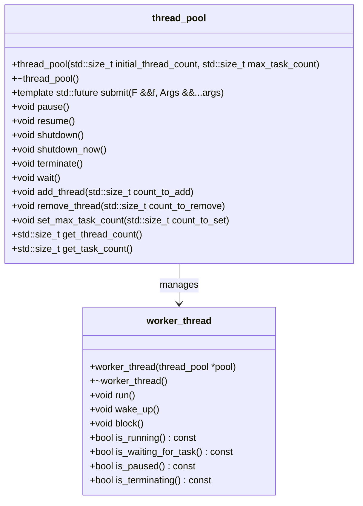
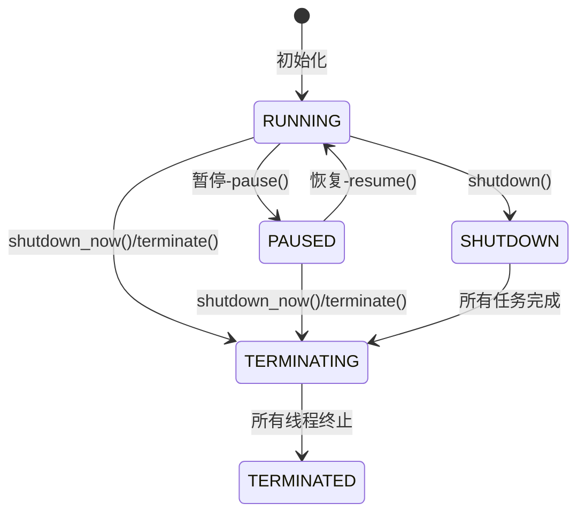
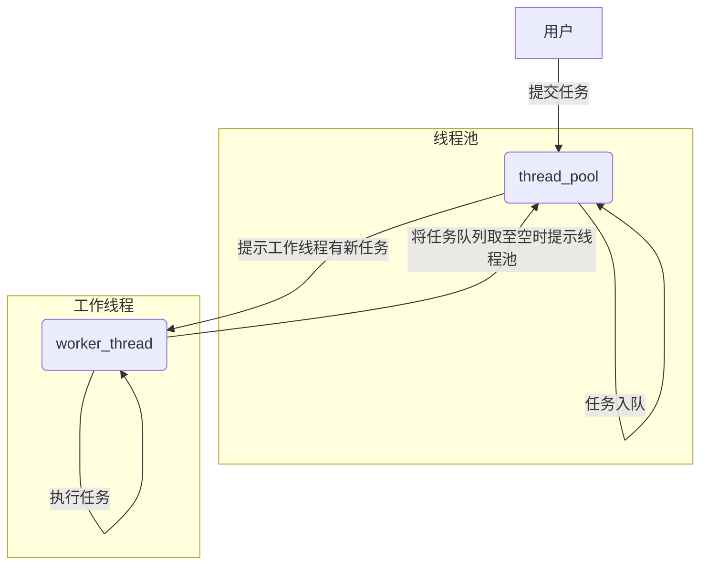
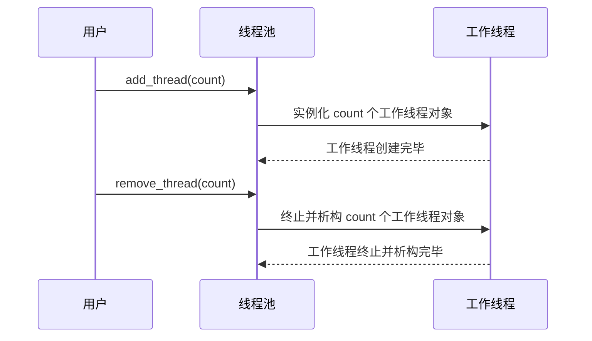

# 一个C++实现的线程池 - C++ Thread Pool

> A thread pool implemented in modern C++.
>
> 代码已开源在 [GitHub](https://github.com/Razirp/ThreadPool)。

## I. 引言

在现代软件开发中，多线程编程已经成为提高应用程序性能、实现并发任务处理的重要手段。然而，直接管理多个线程往往伴随着复杂性增加、资源浪费和同步问题。为了解决这些问题，**线程池**作为一种有效的线程管理机制应运而生。

**线程池**预先创建一组工作线程，将待执行任务提交到线程池，由池内线程负责任务的分配与执行，从而简化线程管理、减少系统频繁创建与销毁线程的开销、提高资源利用率。

当前现有的 C++ 线程池实现往往难以在简单易用性和文档的丰富性上取得平衡：

- 具有良好文档说明的 C++ 线程池项目常常规模庞大、依赖复杂，难以快速理解或上手使用；
- 实现简单的 C++ 项目往往缺乏足够的文档说明，开发者需要自行阅读源代码来理解其实现原理与使用方式。

此外对于像作者一样的以中文为母语的开发者（这一群体属实人数众多🥸）而言，我们常常感到缺乏足够的拥有中文文档的项目可供研究（甚至很多项目即使是由中国开发者开发的，它们的文档仍然是英文🥲），往往需要被迫使用英语等非母语语言进行文档的阅读，不能达到最佳效率。

针对上述问题，作者希望能够实现一个**简单易用**并且具有丰富**中/英文文档**说明的 C++ 线程池库，以期能够助力于开发者社区的学习、研究与使用。

> 代码已开源在 [GitHub](https://github.com/Razirp/ThreadPool)。

### 线程池的优势

#### 资源管理与性能优化

- **避免频繁创建与销毁线程**：线程池预先创建并维护一定数量的工作线程，避免了频繁创建和销毁线程带来的系统开销，特别是在处理大量短生命周期任务时，效果尤为显著。
- **均衡负载与缓存局部性**：线程池可以根据任务负载动态调整线程工作状态，避免过度竞争和闲置。同时，线程在执行任务过程中可以充分利用CPU缓存，提高执行效率。
- **控制并发级别**：通过限制线程池大小和任务队列容量，可以有效控制系统的并发级别，防止因过度并发导致的资源争抢和性能下降。

#### 简化编程模型

- **统一任务提交接口**：线程池提供统一的接口供开发者提交任务，无需关心线程创建、同步等底层细节，降低了多线程编程的复杂度。
- **异常处理与任务取消**：线程池通常支持异常处理机制和任务取消功能，使得在出现异常情况或需求变更时，可以更方便地管理和调整任务执行。
  - 但本项目目前还未针对这一方面进行特别的实现🥲。

## II. 设计概览



### 库架构

线程池采用了模块化设计，主要由以下几个核心组件构成：

1. **`thread_pool` 类**：作为用户直接交互的接口，负责任务调度、线程管理等核心功能。用户通过创建 `thread_pool` 实例提交任务，控制线程池状态，并获取线程池相关信息。

   > [点此](https://github.com/Razirp/ThreadPool/blob/main/docs/API%20docs/thread_pool.md)查看 `thread_pool` 类的 API 参考文档。

2. **`thread_pool::worker_thread` 类**：作为线程池内部的工作单元，每个 `thread_pool::worker_thread` 对象代表一个独立的工作线程，负责从任务队列中取出任务并执行。

   > [点此](https://github.com/Razirp/ThreadPool/blob/main/docs/API%20docs/worker_thread.md)查看 `thread_pool::worker_thread` 类的 API 参考文档。

3. **辅助工具**：包括同步原语（如互斥锁、条件变量、信号量等）以及状态管理机制，它们为线程池和工作线程之间的通信、任务同步、状态变更等操作提供了必要的支撑。

各组件间的关系如下：

- `thread_pool` 类维护一个工作线程列表 `std::list<worker_thread>`，并通过同步原语控制任务队列的访问与状态变更。
- `thread_pool::worker_thread` 类通过与 `thread_pool` 对象的交互，获取待执行任务、更新自身状态，并响应来自 `thread_pool` 的指令（如暂停、恢复、终止等）。
- 辅助工具贯穿于整个库的设计与实现中，确保并发环境下的数据一致性与操作安全性。

### 关键类与接口

#### `thread_pool` 类

**功能定位**：`thread_pool` 类是用户与线程池库交互的主要入口，封装了线程池创建、任务提交、状态控制、属性调整与信息获取等核心功能。

**主要API**：

- **构造函数**：接受初始工作线程数和最大任务队列容量作为参数，创建并初始化线程池。

- **任务提交**：提供模板方法 `submit`，接受可调用对象（如函数、lambda 表达式）及参数，将其封装为任务提交至任务队列，并返回一个 `std::future` 对象，用于获取任务执行结果。

- **线程池控制**：
  - **`pause`**：暂停线程池，阻止新任务的执行并暂停当前运行的任务。
  - **`resume`**：恢复线程池的运行，继续处理队列中的任务。
  - **`shutdown`**：设置线程池为等待任务完成状态，等待所有已提交任务执行完毕后终止线程池。
  - **`shutdown_now`**：立即终止线程池，丢弃任务队列中的未处理任务。

- **属性调整与信息获取**：
  - **`add_thread`**：动态向线程池添加工作线程。
  - **`remove_thread`**：从线程池中移除指定数量的工作线程。
  - **`set_max_task_count`**：限制任务队列中允许的最大任务数量。
  - **`get_thread_count`**：查询当前线程池中活动的工作线程数。
  - **`get_task_count`**：查询等待执行的任务数量。

#### `thread_pool::worker_thread` 类（内部实现）

**功能定位**：`thread_pool::worker_thread` 类是线程池内部的工作单元，负责从任务队列中取出任务并执行。其状态机模型、任务循环逻辑以及响应线程池指令的方式直接影响线程池的性能与稳定性。

**内部状态与行为**：

- **状态机**：`thread_pool::worker_thread` 对象具有多种状态（如运行、暂停、等待任务、将终止、已终止等），通过状态机模型管理状态变迁。
- **任务循环**：每个工作线程在一个无限循环中，根据自身状态执行相应操作，如从任务队列取任务、执行任务、响应线程池指令（如暂停、恢复、终止）等。
- **响应指令**：通过监听线程池状态变更信号和条件变量，`thread_pool::worker_thread` 能够及时响应来自 `thread_pool` 的指令，调整自身状态并执行相应操作。

## III. 实现细节剖析

### 线程池核心机制

#### 任务队列

**数据结构选择**：任务队列采用 `std::queue` 实现，它是一种先进先出（FIFO）的数据结构，符合线程池任务调度的基本原则——按提交顺序依次执行。

**同步机制**：

- **互斥锁**：使用 `std::shared_mutex` 保护任务队列的访问，确保在多线程环境下对任务队列的操作是线程安全的。读取任务队列状态（如查询任务数量）时使用 `std::shared_lock`，仅需读取权限；向队列添加或移除任务时使用 `std::unique_lock`，需要独占访问权限。

- **条件变量**：使用 `std::condition_variable_any` 协调线程间的同步。当任务队列为空时，等待任务的线程会被阻塞，直到有新任务入队或线程池状态发生改变时，通过条件变量唤醒等待的线程。

#### 工作线程管理

**创建与销毁**：在 `thread_pool` 构造函数中创建指定数量的工作线程，并将它们加入工作线程列表。线程池析构时，通过调用`thread_pool::worker_thread`的`terminate`方法终止所有工作线程，并等待其退出。

**状态切换**：

- **线程状态**：使用 `std::atomic<>` 存储线程状态，确保在多线程环境下状态变更的原子性。
  - `std::atomic<>` 是 C++ 标准库中的原子变量类型，可以保证对该类型的对象的读/写等操作是原子的。

- **同步原语**：
  - **互斥锁**：保护线程状态的访问，确保状态变更操作的原子性。
  - **条件变量**：用于工作线程等待任务、响应线程池指令等场景，实现线程间的同步。
  - **信号量**：在 `thread_pool::worker_thread` 类中使用 `std::binary_semaphore` 实现线程的暂停与恢复。

#### 线程池状态机



**状态枚举定义**：定义了如`RUNNING`、`PAUSED`、`SHUTDOWN`等状态枚举值，用于表示线程池的不同运行状态。

```c++
enum class status_t : std::int8_t { 
        TERMINATED = -1, 
        TERMINATING = 0, 
        RUNNING = 1, 
        PAUSED = 2, 
        SHUTDOWN = 3
    };  // 线程池的状态，-1: 线程池已终止；0: 线程池将终止；1: 线程池正在运行；2: 线程池被暂停；3: 线程池在等待任务完成，但不再接受新任务
```

**状态变更操作**：

- **原子性保证**：通过在状态变更操作前后加锁解锁 `status_mutex`，确保状态变更的原子性。

- **并发安全性**：在状态变更时，通过检查当前状态并相应地调整线程池及工作线程的行为，确保在并发环境下的正确性与一致性。

### 任务调度与执行



#### 任务提交

**`submit` 方法实现**：

> 代码见 [GitHub](https://github.com/Razirp/ThreadPool/blob/main/include/thread_pool.hpp) 或 [附录](##`submit()` 任务提交函数)。

1. **模板函数包装**：接受可调用对象（如函数、lambda表达式）及参数，利用模板参数推导，将任务及其参数封装为一个无参的 `std::function<void()>`。

   > 封装为无参函数对象是为了，在工作线程中可以用统一的格式（直接用 `()` 进行调用）对任何形式的任务进行调用执行。

2. **任务封装**：使用 `std::packaged_task` 将任务包装为可获取异步结果的对象，并通过其 `get_future` 方法获取一个 `std::future`，用于后续获取任务执行结果。

3. **入队**：在确保线程池状态稳定的前提下，将任务放入任务队列，并通过条件变量通知等待任务的工作线程。

#### 工作线程任务循环

**逻辑流程**：

> 代码见 [GitHub](https://github.com/Razirp/ThreadPool/blob/main/src/worker_thread.cpp) 或 [附录](##工作线程任务循环的逻辑)。

1. **获取任务**：在循环中，工作线程首先检查线程池状态，根据状态决定是否继续执行任务或进行其他操作（如暂停、等待任务、终止等）。

2. **执行任务**：从任务队列中取出任务并执行。如果任务执行过程中抛出异常，捕获并记录异常信息，然后继续处理下一个任务。

3. **等待新任务**：当任务队列为空时，工作线程进入等待状态，直到有新任务入队或线程池状态变化时被唤醒。

4. **响应线程池指令**：根据线程池状态变更，如接收到暂停、恢复、终止等指令，工作线程调整自身状态并执行相应操作。

## IV. 库特性与优化

### 动态线程调整



**`add_thread` 与 `remove_thread` 方法**：

- **实现**：这两个方法允许用户在运行时动态调整线程池中的工作线程数量。`add_thread` 创建新的 `thread_pool::worker_thread` 对象并加入工作线程列表， `remove_thread` 则选择适当的工作线程终止并从列表中移除。

  - > 当想要移除的线程数量大于等于当前工作线程数时，会将所有的工作线程移除。

- **使用场景**：在任务负载变化较大或需要针对特定硬件资源进行优化时，动态调整工作线程数有助于保持良好的系统性能。例如，当任务数量激增时，增加工作线程可以充分利用多核处理器，提高任务处理速度；反之，在任务稀疏时减少工作线程，可避免资源浪费和过度竞争。

**性能影响分析**：

- **积极影响**：动态调整线程数有助于适应负载波动，避免线程过多导致的上下文切换开销和资源争抢，或线程过少导致的处理器利用率低下。

- **注意事项**：频繁调整线程数可能导致性能波动和额外开销。应根据实际应用需求和监控数据，适度、适时地调整线程数，以达到最佳性能平衡。

#### 任务队列容量限制

**`set_max_task_count` 方法**：

- **实现**：该方法用于设置任务队列允许的最大任务数量。当任务队列接近或达到最大容量时，新提交的任务将被拒绝，返回一个错误提示。

- **应用场景**：在处理高优先级任务或资源有限的场景下，限制任务队列容量有助于避免低优先级任务积压，确保高优先级任务得到及时处理。此外，也可以通过调整任务队列容量来控制系统的内存使用，防止因任务堆积导致的内存溢出。

  - > 对任务优先级的特性还有待实现。


**拒绝策略**：

- **抛出异常**：当任务队列满且新任务被拒绝时，`submit` 方法抛出 `std::runtime_error` 异常，通知调用者无法提交任务。

### 线程池优雅关闭与即时终止

**`shutdown` 与 `shutdown_now` 方法**：

- **优雅关闭**：`shutdown` 方法将线程池设置为等待任务完成状态，允许已提交的任务继续执行，但不再接受新任务。所有任务完成后，线程池自动终止。

- **即时终止**：`shutdown_now` 方法立即停止线程池，丢弃任务队列中的未处理任务，工作线程立即结束执行。

**资源清理与完整性**：

- **资源释放**：在终止线程池时，确保所有工作线程被正确地终止并等待其退出，同时清理相关资源，如释放互斥锁、条件变量等。

- **任务完整性**：使用 `shutdown` 方法可以保证所有已提交任务得到完整执行，适用于需要保证任务结果的场景；而 `shutdown_now` 适用于紧急情况或测试环境，可能牺牲部分未完成任务的完整性。

## V. 示例代码与应用示例

### 基础使用示例

以下是一个使用C++线程池库的基本示例，展示了如何创建线程池、提交不同类型任务、控制线程池状态等操作。

```cpp
#include "thread_pool.hpp"

// 定义一个简单的计算任务
double compute(int x, int y) {
    return static_cast<double>(x) / y;
}

int main() {
    // 创建一个初始包含4个工作线程的线程池，任务队列最大容量为100
    thread_utils::thread_pool pool(4, 100);

    // 提交一个计算任务，返回结果的future
    auto future = pool.submit(compute, 100, 5);

    // 提交一个lambda任务
    pool.submit([]() {
        std::cout << "Hello from a lambda task!" << std::endl;
    });

    // 暂停线程池，阻止新任务的执行
    pool.pause();

    // ...在此期间可以进行其他操作...

    // 恢复线程池，继续处理任务
    pool.resume();

    // 等待计算任务完成并获取结果
    double result = future.get();
    std::cout << "Result: " << result << std::endl;

    // 关闭线程池，等待所有任务完成
    pool.shutdown();

    return 0;
}
```

### 实际应用案例

假设我们正在开发一个Web服务器，需要处理大量并发的HTTP请求。使用C++线程池库，可以简化请求处理的多线程编程，提高服务器性能。

```cpp
#include "thread_pool.hpp"
#include "http_request.h"  // 假设已定义HttpRequest类

// 定义处理HTTP请求的回调函数
void handle_request(const HttpRequest& request, HttpResponse& response) {
    // ...实际处理逻辑...
}

int main() {
    // 创建一个初始包含8个工作线程的线程池，任务队列无容量限制
    thread_utils::thread_pool pool(8);

    // 循环接收并处理HTTP请求
    while (true) {
        HttpRequest request = receive_request();  // 假设receive_request从网络接收一个请求
        HttpResponse response;

        // 将请求处理任务提交到线程池
        pool.submit([request, &response]() {
            handle_request(request, response);
            send_response(response);  // 假设send_response将处理结果发送回客户端
        });
    }

    // ...在适当时候调用pool.shutdown()关闭线程池...

    return 0;
}
```

---

以上示例代码展示了如何在实际项目中使用C++线程池库提交并行任务、控制线程池状态以及处理特定应用需求。通过这些示例，读者可以直观地理解库的使用方法，并将其应用到自己的项目中。

## VI. 性能测试与对比

> 限于时间和精力，目前仅对本线程池库进行了简单的功能和性能测试。本部分内容有待进一步工作来完善。同时我们欢迎有兴趣的社区成员向本项目提供您进行的性能测试与对比的基准及其结果！

### 简单的功能测试

简单地测试了一下线程池的任务提交、结果获取、任务抛出异常、暂停/恢复线程池、增加/删除线程、设置最大任务队列长度、终止线程等基本的线程池功能。

```cpp
#include <iostream>
#include <cassert>
#include "thread_pool.hpp"

// Test function
int add(int a, int b) {
    return a + b;
}

// Test function that throws an exception
void throw_exception() {
    throw std::runtime_error("Test exception");
}

int main() {
    // Create a thread pool with 4 threads
    thread_utils::thread_pool pool(4);

    // Test submitting a task and getting the result
    auto future = pool.submit(add, 2, 3);
    assert(future.get() == 5);
    std::cout << "Test 1 passed!" << std::endl;

    // Test submitting multiple tasks
    auto future1 = pool.submit(add, 4, 5);
    auto future2 = pool.submit(add, 6, 7);
    assert(future1.get() == 9);
    assert(future2.get() == 13);
    std::cout << "Test 2 passed!" << std::endl;

    // Test submitting tasks that throw exceptions
    auto future3 = pool.submit(throw_exception);
    try {
        future3.get();
        assert(false); // Should not reach here
    } catch (const std::runtime_error& e) {
        assert(std::string(e.what()) == "Test exception");
    }
    std::cout << "Test 3 passed!" << std::endl;

    // Test pausing and resuming the thread pool
    pool.pause();
    try {
        pool.submit(add, 8, 9); // Should throw exception because pool is paused
        assert(false); // Should not reach here
    } catch (const std::runtime_error& e) {
        assert(std::string(e.what()) == "[thread_pool::submit][error]: thread pool is paused");
    }
    pool.resume();
    auto future4 = pool.submit(add, 8, 9);
    assert(future4.get() == 17);
    std::cout << "Test 4 passed!" << std::endl;

    // Test adding and removing threads from the pool
    pool.add_thread(2);
    assert(pool.get_thread_count() == 6);
    pool.remove_thread(3);
    assert(pool.get_thread_count() == 3);
    std::cout << "Test 5 passed!" << std::endl;

    while (pool.get_task_count() > 0)
    {
        std::this_thread::sleep_for(std::chrono::milliseconds(100));
    }
    // Test setting the maximum task count
    pool.set_max_task_count(2);
    auto future5 = pool.submit(add, 10, 11);
    auto future6 = pool.submit(add, 12, 13);
    try {
        pool.submit(add, 14, 15); // Should throw exception because task queue is full
        assert(false); // Should not reach here
    } catch (const std::runtime_error& e) {
        assert(std::string(e.what()) == "[thread_pool::submit][error]: task queue is full");
    }
    std::cout << "Test 6 passed!" << std::endl;

    // Test shutting down the thread pool
    pool.shutdown();
    try {
        pool.submit(add, 16, 17); // Should throw exception because pool is shutting down
        assert(false); // Should not reach here
    } catch (const std::runtime_error& e) {
        assert(std::string(e.what()) == "[thread_pool::submit][error]: thread pool is terminated");
    }
    std::cout << "Test 7 passed!" << std::endl;

    std::cout << "All tests passed!" << std::endl;

    return 0;
}
```

### 简单的性能测试

简单地对比了一下使用线程池和串行执行任务的所需时间的差别。

```cpp
#include <iostream>
#include <chrono>
#include "thread_pool.hpp"

int main() {
    // Create a thread pool object
    thread_utils::thread_pool pool(10);

    // Define the task to be executed by the thread pool
    auto task = []() {
        // Perform some computation or task here
        std::this_thread::sleep_for(std::chrono::milliseconds(10));
    };

    // Start the timer
    auto start = std::chrono::high_resolution_clock::now();

    // Submit the task to the thread pool multiple times
    for (int i = 0; i < 1000; i++) {
        pool.submit(task);
    }

    // Wait for all tasks to complete
    pool.wait();

    // Stop the timer
    auto end = std::chrono::high_resolution_clock::now();

    // Calculate the elapsed time
    auto duration = std::chrono::duration_cast<std::chrono::milliseconds>(end - start).count();

    // Print the performance result
    std::cout << "Elapsed time: " << duration << " milliseconds" << std::endl;

    // Compare with the performance of executing tasks sequentially
    start = std::chrono::high_resolution_clock::now();
    for (int i = 0; i < 1000; i++) {
        task();
    }
    end = std::chrono::high_resolution_clock::now();
    duration = std::chrono::duration_cast<std::chrono::milliseconds>(end - start).count();
    std::cout << "Sequential execution time: " << duration << " milliseconds" << std::endl;

    return 0;
}
```

## VII. 未来展望

尽管本 C++ 线程池实现已经具备了诸多实用功能和良好性能，但仍有进一步优化和扩展的空间。以下是一些后续计划实现的特性：

### 计划实现的特性

- **更多任务调度策略**：目前仅支持先进先出（FIFO）策略，未来将加入更多调度算法，如优先级调度、定时调度等，以满足不同应用场景的需求。

- **核心线程数与最大线程数概念**：引入核心线程数和最大线程数的概念，使得线程池能在工作负载变化时自动调整线程数量。核心线程始终保留在池中，而最大线程数则限定线程池可动态扩展的上限。

- **任务拒绝策略**：除了现有的队列满时拒绝新任务外，将实现更丰富的任务拒绝策略，并允许用户自定义拒绝策略，以应对任务队列饱和的不同处理需求。

- **深度测试与验证**：进行更全面的功能测试、性能基准测试，包括与现有线程池库的对比分析，以充分展现本库的功能稳定性和性能优势。

---

综上所述，希望这个基于现代 C++ 的线程池实现能够为更多C++开发者的工作提供帮助或启发。

## 附录. 一些关键实现的代码

### `submit()` 任务提交函数

```cpp
/**
 * Submits a task to the thread pool for execution.
 *
 * This function submits a task to the thread pool for execution. The task is a callable object
 * that takes arguments specified by the template parameters. The function returns a std::future
 * object that can be used to retrieve the result of the task once it has completed.
 *
 * @tparam F The type of the callable object.
 * @tparam Args The types of the arguments to the callable object.
 * @param f The callable object to be executed.
 * @param args The arguments to be passed to the callable object.
 * @return A std::future object representing the result of the task.
 * @throws std::runtime_error if the thread pool is in an invalid state or the task queue is full.
 */
template<typename F, typename... Args>
auto thread_pool::submit(F&& f, Args&&... args) -> std::future<decltype(f(args...))>
{   // 提交任务
    std::shared_lock<std::shared_mutex> status_lock(status_mutex);  // 为状态变量加共享锁，以确保线程池的状态是稳定的
    switch (status.load())
    {
    case status_t::TERMINATED: // 线程池已终止
        throw std::runtime_error("[thread_pool::submit][error]: thread pool is terminated");
    case status_t::TERMINATING: // 线程池将终止
        throw std::runtime_error("[thread_pool::submit][error]: thread pool is terminating");
    case status_t::PAUSED: // 线程池被暂停
        throw std::runtime_error("[thread_pool::submit][error]: thread pool is paused");
    case status_t::SHUTDOWN: // 线程池在等待任务完成，但不再接受新任务
        throw std::runtime_error("[thread_pool::submit][error]: thread pool is waiting for tasks to complete, but not accepting new tasks");
    case status_t::RUNNING: // 线程池正在运行
        break;
    default:
        throw std::runtime_error("[thread_pool::submit][error]: unknown status");
    }
    
    if (max_task_count > 0 && get_task_count() >= max_task_count)
    {   // 如果任务队列已满，则拒绝提交任务
        throw std::runtime_error("[thread_pool::submit][error]: task queue is full");
    }
    using return_type = decltype(f(args...));
    auto task = std::make_shared<std::packaged_task<return_type()>>(
        std::bind(std::forward<F>(f), std::forward<Args>(args)...)
    );
    std::future<return_type> res = task->get_future();

    std::unique_lock<std::shared_mutex> lock(task_queue_mutex);
    task_queue.emplace([task](){ (*task)(); }); // 将任务封装为一个lambda表达式并放入任务队列   // 该lambda表达式会调用std::packaged_task对象的operator()方法，从而执行任务
    lock.unlock();
    task_queue_cv.notify_one();
    return res;
}
```

### 工作线程任务循环的逻辑

```cpp
thread_pool::worker_thread::worker_thread(thread_pool* pool) : 
    pool(pool), 
    status(status_t::RUNNING), 
    pause_sem(0), 
    thread(
        [this](){       // 线程的执行逻辑
            while (true)
            {   
                std::unique_lock<std::shared_mutex> unique_lock_status(this->status_mutex);
                while(true)
                {
                    if (!unique_lock_status.owns_lock())
                    {
                        unique_lock_status.lock();
                    }
                    bool break_flag = false;
                    switch (this->status.load())
                    {
                    case status_t::TERMINATING: // 线程被设置为将终止
                        this->status.store(status_t::TERMINATED);
                    case status_t::TERMINATED:  // 线程已终止
                        return;
                    case status_t::RUNNING: // 线程被设置为运行
                        break_flag = true;
                        break;
                    case status_t::PAUSED:   // 线程被设置为暂停
                        unique_lock_status.unlock();
                        this->pause_sem.acquire();  // 阻塞线程
                        break;
                    case status_t::BLOCKED:  // 线程被设置为等待任务
                    default:    // 未知状态
                        unique_lock_status.unlock();
                        throw std::runtime_error("[thread_pool::worker_thread::worker_thread][error]: undefined status");
                    }
                    if (break_flag)
                    {
                        unique_lock_status.unlock();
                        break;
                    }
                }
                // 在运行状态下，从任务队列中取出一个任务并执行
                std::unique_lock<std::shared_mutex> unique_lock_task_queue(this->pool->task_queue_mutex);    // 在取任务前，加锁
                while (this->pool->task_queue.empty())
                {   // 如果任务队列为空，则等待条件变量唤醒
                    while(true)
                    {
                        if (!unique_lock_status.owns_lock())
                        {
                            unique_lock_status.lock();
                        }
                        bool break_flag = false;
                        switch (this->status.load())
                        {
                        case status_t::TERMINATING: // 线程被设置为将终止
                            this->status.store(status_t::TERMINATED);
                        case status_t::TERMINATED:  // 线程已终止
                            return;
                        case status_t::PAUSED:  // 线程被设置为暂停
                            unique_lock_status.unlock();
                            unique_lock_task_queue.unlock();
                            this->pause_sem.acquire();  // 阻塞线程
                            unique_lock_task_queue.lock();
                            break;
                        case status_t::RUNNING: // 线程被设置为运行
                            this->status.store(status_t::BLOCKED);  // 设置线程状态为等待任务
                        case status_t::BLOCKED:  // 线程被设置为等待任务
                            break_flag = true;
                            break;
                        default:    // 未知状态
                            unique_lock_status.unlock();
                            unique_lock_task_queue.unlock();
                            throw std::runtime_error("[thread_pool::worker_thread::worker_thread][error]: unknown status");
                        }
                        if (break_flag)
                        {
                            unique_lock_status.unlock();
                            break;
                        }
                    }
                    this->pool->task_queue_cv.wait(unique_lock_task_queue); // 等待条件变量唤醒；
                    while(true)
                    {
                        if (!unique_lock_status.owns_lock())
                        {
                            unique_lock_status.lock();
                        }
                        bool break_flag = false;
                        switch (this->status.load())
                        {
                        case status_t::TERMINATING: // 线程被设置为将终止
                            this->status.store(status_t::TERMINATED);
                        case status_t::TERMINATED:  // 线程已终止
                            return;
                        case status_t::PAUSED:  // 线程被设置为暂停
                            unique_lock_status.unlock();
                            unique_lock_task_queue.unlock();
                            this->pause_sem.acquire();  // 阻塞线程
                            unique_lock_task_queue.lock();
                            break;
                        case status_t::BLOCKED:  // 线程被设置为等待任务
                            this->status.store(status_t::RUNNING);  // 设置线程状态为运行
                        case status_t::RUNNING: // 线程被设置为运行
                            break_flag = true;
                            break;
                        default:    // 未知状态
                            unique_lock_status.unlock();
                            throw std::runtime_error("[thread_pool::worker_thread::worker_thread][error]: unknown status");
                        }
                        if (break_flag)
                        {
                            unique_lock_status.unlock();
                            break;
                        }
                    }
                }
                // 取出一个任务
                try
                {
                    std::function<void()> task = std::move(this->pool->task_queue.front());
                    this->pool->task_queue.pop();
                    if (this->pool->task_queue.empty())
                    {   // 如果任务队列为空，则通知任务队列空条件变量
                        this->pool->task_queue_empty_cv.notify_all();
                    }
                    unique_lock_task_queue.unlock();  // 取出任务后，释放锁
                    task();     // 执行任务
                }
                catch(const std::exception& e)
                {   // 如果任务执行过程中发生异常，则打印异常信息并继续循环
                    std::cerr << e.what() << '\n';
                    continue;
                }
            }
        }
    ) {}
```
