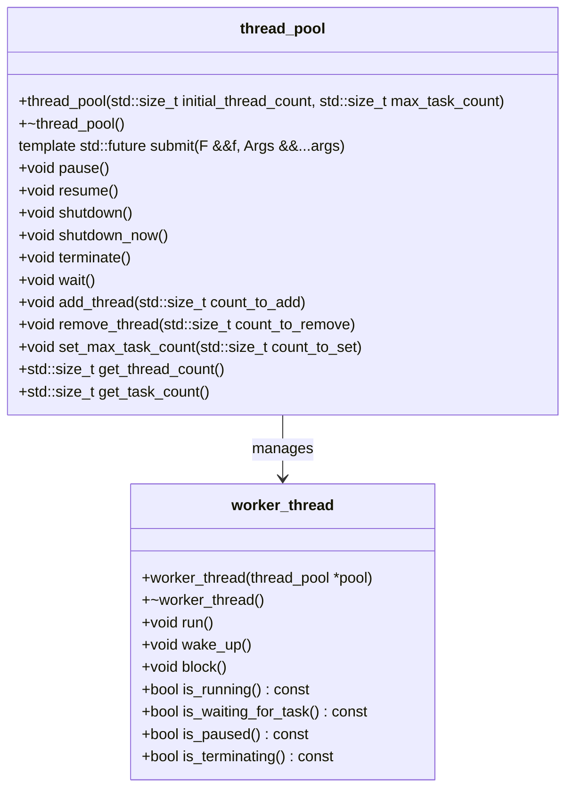
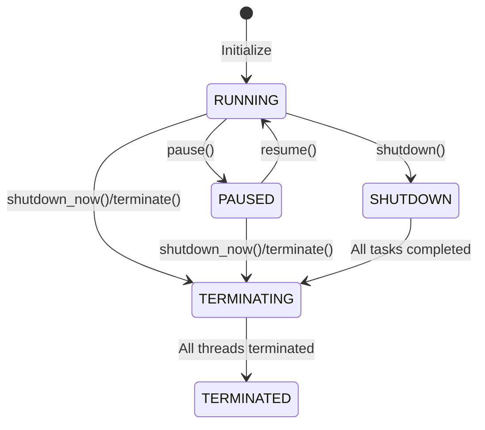
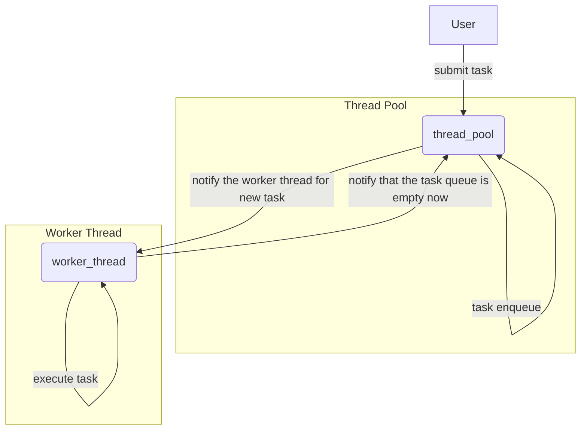
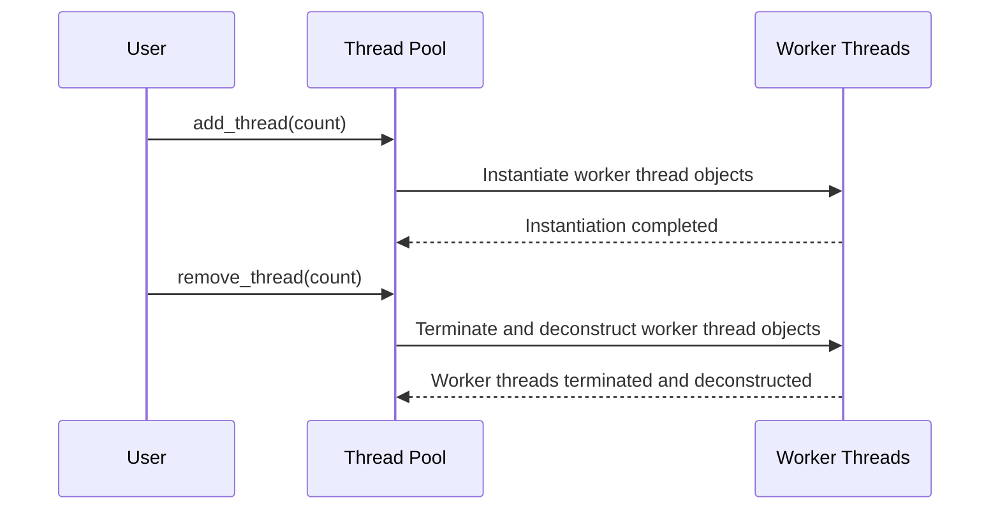

# A C++ Thread Pool Implementation

> A thread pool implemented in modern C++.
>
> The code has been open-sourced on [GitHub](https://github.com/Razirp/ThreadPool).
>

## I. Introduction

In modern software development, multithreading has become an essential approach to enhancing application performance and handling concurrent tasks. However, directly managing multiple threads often leads to increased complexity, resource wastage, and synchronization issues. To address these problems, thread pools have emerged as an effective thread management mechanism.

Thread pools pre-create a group of worker threads, to which tasks to be executed are submitted. The pool is responsible for task distribution and execution, thereby simplifying thread management, reducing the system's overhead from frequent thread creation and destruction, and improving resource utilization.

Current C++ thread pool implementations often struggle to balance ease of use with comprehensive documentation:

- Projects with good documentation are often large in scale and complex in dependencies, making them difficult to quickly understand or start using.
- Simpler C++ projects often lack sufficient documentation, requiring developers to read the source code to understand the principles and usage methods.

Additionally, for developers whose native language is Chinese (a significant number 🥸), there is a perceived lack of projects with Chinese documentation available for study. Even projects developed by Chinese developers often have documentation in English 🥲, which can hinder efficiency as it requires the use of a non-native language.

To tackle these issues, the author aims to implement a simple and easy-to-use C++ thread pool library with rich documentation in both Chinese and English, hoping to contribute to the learning, research, and use within the developer community.

The code has been open-sourced on [GitHub](https://github.com/Razirp/ThreadPool).

### Advantages of the Thread Pool

#### Resource Management and Performance Optimization

- **Avoid Frequent Thread Creation and Destruction:** The thread pool pre-creates and maintains a certain number of worker threads, avoiding the system overhead caused by frequent thread creation and destruction, especially effective when handling a large number of short-lived tasks.
- **Balance Load and Cache Locality:** The thread pool can dynamically adjust the working state of threads according to task load, preventing excessive competition and idleness. At the same time, threads can fully utilize CPU cache during task execution to improve efficiency.
- **Control Concurrency Level:** By limiting the size of the thread pool and the capacity of the task queue, the system's level of concurrency can be effectively controlled, preventing resource contention and performance degradation due to excessive concurrency.

#### Simplifying Programming Model

- **Unified Task Submission Interface:** The thread pool provides a unified interface for developers to submit tasks, without the need to concern oneself with the underlying details of thread creation and synchronization, reducing the complexity of multi-threaded programming.
- **Exception Handling and Task Cancellation:** The thread pool typically supports mechanisms for exception handling and task cancellation, making it more convenient to manage and adjust task execution in the event of exceptions or changes in requirements.
  - However, this project has not yet implemented special features for this aspect 🥲.


## II. Design Overview



### Library Architecture

The thread pool adopts a modular design, mainly consisting of the following core components:

- **thread_pool class:** As the interface for direct user interaction, it is responsible for task scheduling, thread management, and other core functionalities. Users create an instance of thread_pool to submit tasks, control the state of the thread pool, and obtain information about the thread pool.
  - Click [here](https://github.com/Razirp/ThreadPool/blob/main/docs_en/API%20docs/thread_pool.md) to view the API reference document for the thread_pool class.
- **thread_pool::worker_thread class:** As the internal work unit of the thread pool, each thread_pool::worker_thread object represents an independent worker thread, responsible for fetching tasks from the task queue and executing them.
  - Click [here](https://github.com/Razirp/ThreadPool/blob/main/docs_en/API%20docs/worker_thread.md) to view the API reference document for the thread_pool::worker_thread class.
- **Auxiliary Tools:** Including synchronization primitives (such as mutexes, condition variables, semaphores, etc.) and state management mechanisms, they provide necessary support for communication between the thread pool and worker threads, task synchronization, and state changes.

The relationships between the components are as follows:

- The `thread_pool` class maintains a list of worker threads `std::list<worker_thread>` and controls access to the task queue and state changes through synchronization primitives.
- The `thread_pool::worker_thread` class interacts with the thread_pool object to obtain tasks to be executed, update its own state, and respond to instructions from the thread_pool (such as pause, resume, terminate, etc.).

Auxiliary tools are integrated throughout the design and implementation of the library to ensure data consistency and operational safety in a concurrent environment.

### Key Classes and Interfaces

#### thread_pool Class

**Function Positioning:** The thread_pool class is the main entry point for user interaction with the thread pool library, encapsulating core functionalities such as thread pool creation, task submission, state control, attribute adjustment, and information acquisition.

**Main APIs:**

- **Constructor:** Accepts the initial number of worker threads and the maximum task queue capacity as parameters to create and initialize the thread pool.
- **Task Submission:** Provides a template method `submit` that accepts a callable object (such as a function or lambda expression) and parameters, encapsulating them as a task submitted to the task queue, and returns a `std::future` object for obtaining the task execution result.
- **ThreadPool Control:**
  - `pause`: Pauses the thread pool, preventing the execution of new tasks and pausing currently running tasks.
  - `resume`: Resumes the operation of the thread pool to continue processing tasks in the queue.
  - `shutdown`: Sets the thread pool to a state where it waits for tasks to complete and then terminates the thread pool after all submitted tasks have been executed.
  - `shutdown_now`: Immediately terminates the thread pool, discarding unprocessed tasks in the queue.
- **Attribute Adjustment and Information Acquisition:**
  - `add_thread`: Dynamically adds worker threads to the thread pool.
  - `remove_thread`: Removes a specified number of worker threads from the thread pool.
  - `set_max_task_count`: Limits the maximum number of tasks allowed in the task queue.
  - `get_thread_count`: Queries the current number of active worker threads in the thread pool.
  - `get_task_count`: Queries the number of tasks waiting to be executed.

#### thread_pool::worker_thread Class (Internal Implementation)

**Function Positioning:** The thread_pool::worker_thread class is the internal work unit of the thread pool, responsible for fetching tasks from the task queue and executing them. Its state machine model, task loop logic, and response to thread pool instructions directly affect the performance and stability of the thread pool.

**Internal States and Behaviors:**

- **State Machine:** The thread_pool::worker_thread object has various states (such as running, paused, waiting for a task, terminating, terminated, etc.), managed through a state machine model for state transitions.
- **Task Loop:** Each worker thread operates in an infinite loop, performing corresponding operations based on its state, such as fetching tasks from the task queue, executing tasks, and responding to thread pool instructions (such as pause, resume, terminate, etc.).
- **Instruction Response:** By listening to thread pool state change signals and condition variables, thread_pool::worker_thread can promptly respond to instructions from the thread_pool, adjust its own state, and perform corresponding operations.

## III. Implementation Details

### Core Mechanisms of the ThreadPool

#### Task Queue

- **Data Structure Choice:** The task queue is implemented using `std::queue`, which is a first-in, first-out (FIFO) data structure that aligns with the basic principle of task scheduling in the thread pool—executing tasks in the order they are submitted.

- **Synchronization Mechanism:**
  - **Mutex:** `std::shared_mutex` is used to protect access to the task queue, ensuring thread-safe operations on the task queue in a multi-threaded environment. A `std::shared_lock` is used when reading the state of the task queue (such as querying the number of tasks), requiring only read access; a `std::unique_lock` is used when adding or removing tasks from the queue, requiring exclusive access.
  - **Condition Variable:** `std::condition_variable_any` is used to coordinate synchronization between threads. When the task queue is empty, threads waiting for tasks are blocked until a new task is enqueued or the state of the thread pool changes, at which point the waiting threads are awakened through the condition variable.
  
#### Worker Thread Management

- **Creation and Destruction:** In the thread_pool constructor, a specified number of worker threads are created and added to the list of worker threads. When the thread pool is destructed, all worker threads are terminated by calling the terminate method of thread_pool::worker_thread and waiting for their exit.

**State Transition:**

- **Thread State:** The thread state is stored using `std::atomic<>`, ensuring the atomicity of state changes in a multi-threaded environment.
- **Synchronization Primitives:**
  - **Mutex:** Protects access to the thread state to ensure the atomicity of state change operations.
  - **Condition Variable:** Used for scenarios where worker threads wait for tasks or respond to thread pool instructions, achieving synchronization between threads.
  - **Semaphore:** In the thread_pool::worker_thread class, `std::binary_semaphore` is used to implement thread pausing and resuming.

#### ThreadPool State Machine



**State Enumeration Definition:** Defines state enumeration values such as RUNNING, PAUSED, SHUTDOWN, etc., to represent different runtime states of the thread pool.

```cpp
enum class status_t : std::int8_t { 
        TERMINATED = -1, 
        TERMINATING = 0, 
        RUNNING = 1, 
        PAUSED = 2, 
        SHUTDOWN = 3
    }; 
```

**State Change Operations:**

- **Atomicity Guarantee:** By locking and unlocking the `status_mutex` before and after state change operations, the atomicity of state changes is ensured.
- **Concurrency Safety:** When changing states, by checking the current state and adjusting the behavior of the thread pool and worker threads accordingly, correctness and consistency are ensured in a concurrent environment.

#### Task Scheduling and Execution



**Task Submission:**

- **Implementation of the submit method:** See [GitHub](https://github.com/Razirp/ThreadPool/blob/main/include/thread_pool.hpp) or [appendix](##The `submit()` Task Submission Function) for code.
- **Template Function Wrapping:** Accepts a callable object (such as a function or lambda expression) and parameters, using template parameter deduction to encapsulate the task and its parameters into a no-argument `std::function<void()>`.
- **Task Encapsulation:** Uses `std::packaged_task` to wrap the task into an object that can obtain asynchronous results, and its `get_future` method is used to obtain a `std::future` for subsequent retrieval of the task execution result.
- **Enqueue:** Under the premise of ensuring the stability of the thread pool state, the task is placed in the task queue, and a condition variable is used to notify the waiting worker threads.

**Worker Thread Task Loop:**

- **Logic Flow:** See [GitHub](https://github.com/Razirp/ThreadPool/blob/main/src/worker_thread.cpp) or [appendix](##Worker Thread Task Loop Logic) for code.
- **Obtain Task:** In the loop, the worker thread first checks the thread pool state, deciding whether to continue executing tasks or perform other operations (such as pausing, waiting for tasks, terminating, etc.).
- **Execute Task:** The task is taken from the task queue and executed. If an exception is thrown during task execution, the exception information is captured and recorded, and then the next task is processed.
- **Wait for New Task:** When the task queue is empty, the worker thread enters a waiting state until a new task is enqueued or the thread pool state changes, at which point it is awakened.
- **Respond to ThreadPool Instructions:** According to changes in the thread pool state, such as receiving pause, resume, terminate instructions, the worker thread adjusts its own state and performs corresponding operations.

## IV. Library Features and Optimizations

#### Dynamic Thread Adjustment



**add_thread and remove_thread methods:**

- **Implementation:** These methods allow users to dynamically adjust the number of worker threads in the thread pool during runtime. `add_thread` creates new `thread_pool::worker_thread` objects and adds them to the worker thread list, while `remove_thread` selects appropriate worker threads to terminate and removes them from the list.
- **Usage Scenarios:** When task load varies significantly or optimization for specific hardware resources is required, dynamically adjusting the number of worker threads helps maintain good system performance. For example, increasing the number of worker threads when the task volume surges can fully utilize multi-core processors and improve task processing speed; conversely, reducing worker threads when tasks are sparse can prevent resource wastage and excessive competition.

**Performance Impact Analysis:**

- **Positive Impact:** Dynamic adjustment of the thread count helps adapt to load fluctuations, avoiding the overhead of context switching and resource contention caused by too many threads, or low processor utilization due to too few threads.
- **Precautions:** Frequent adjustment of the thread count may lead to performance fluctuations and additional overhead. It should be adjusted moderately and timely according to actual application requirements and monitoring data to achieve the best performance balance.

#### Task Queue Capacity Limit

**set_max_task_count method:**

- **Implementation:** This method is used to set the maximum number of tasks allowed in the task queue. When the task queue is close to or reaches full capacity, new tasks submitted will be rejected and an error message will be returned.
- **Application Scenarios:** In scenarios where high-priority tasks are handled or resources are limited, limiting the task queue capacity helps prevent the backlog of low-priority tasks and ensures that high-priority tasks are processed promptly. Additionally, adjusting the task queue capacity can control the system's memory usage and prevent memory overflow caused by task accumulation.
- **Task Prioritization Feature:** There is still work to be done on implementing features related to task prioritization.

**Rejection Strategy:**

- **Throwing Exceptions:** When the task queue is full and a new task is rejected, the `submit` method throws a `std::runtime_error` exception to notify the caller that the task cannot be submitted.

#### Graceful Shutdown and Immediate Termination of the ThreadPool

**shutdown and shutdown_now methods:**

- **Graceful Shutdown:** The `shutdown` method sets the thread pool to a state where it waits for tasks to complete, allowing submitted tasks to continue execution but no longer accepting new tasks. Once all tasks are completed, the thread pool is automatically terminated.
- **Immediate Termination:** The `shutdown_now` method immediately stops the thread pool, discarding unprocessed tasks in the queue, and worker threads immediately end execution.

**Resource Cleanup and Integrity:**

- **Resource Release:** When terminating the thread pool, ensure that all worker threads are correctly terminated and wait for their exit, while also cleaning up related resources, such as releasing mutexes and condition variables.
- **Task Integrity:** Using the `shutdown` method can guarantee that all submitted tasks are fully executed, suitable for scenarios where task results need to be ensured; whereas `shutdown_now` is suitable for emergency situations or testing environments, potentially sacrificing the integrity of some uncompleted tasks.

## V. Example Code and Application Examples

#### Basic Usage Example

The following is a basic example of using the C++ thread pool library, demonstrating how to create a thread pool, submit tasks of different types, control the thread pool state, and other operations.

```cpp
#include "thread_pool.hpp"

// Define a simple computation task
double compute(int x, int y) {
  return static_cast<double>(x) / y;
}

int main() {
  // Create a thread pool initially containing 4 worker threads, with a maximum task queue capacity of 100
  thread_utils::thread_pool pool(4, 100);

  // Submit a computation task, returning a future holding the result
  auto future = pool.submit(compute, 100, 5);

  // Submit a lambda task
  pool.submit([]() {
      std::cout << "Hello from a lambda task!" << std::endl;
  });

  // Pause the thread pool, preventing execution of new tasks
  pool.pause();

  // ... Perform other operations during this time ...

  // Resume the thread pool, resuming task processing
  pool.resume();

  // Wait for the computation task to complete and retrieve the result
  double result = future.get();
  std::cout << "Result: " << result << std::endl;

  // Shut down the thread pool, waiting for all tasks to finish
  pool.shutdown();

  return 0;
}
```

#### Practical Application Example

Suppose we are developing a web server that needs to handle a large number of concurrent HTTP requests. Using the C++ thread pool library can simplify the multi-threaded programming for request processing and improve server performance.

```cpp
#include "thread_pool.hpp"
#include "http_request.h"  // Assuming the HttpRequest class is already defined

// Define a callback function for handling HTTP requests
void handle_request(const HttpRequest& request, HttpResponse& response) {
  // ... Actual handling logic ...
}

int main() {
  // Create a thread pool initially containing 8 worker threads, with no limit on task queue capacity
  thread_utils::thread_pool pool(8);

  // Loop to continuously receive and process HTTP requests
  while (true) {
      HttpRequest request = receive_request();  // Assume receive_request fetches a request from the network
      HttpResponse response;

      // Submit the request handling task to the thread pool
      pool.submit([request, &response]() {
          handle_request(request, response);
          send_response(response);  // Assume send_response sends the processed result back to the client
      });
  }

  // ... Call pool.shutdown() at an appropriate time to close the thread pool ...

  return 0;
}
```

The above example code shows how to use the C++ thread pool library to submit parallel tasks, control the thread pool state, and handle specific application requirements in actual projects. Through these examples, readers can intuitively understand the usage of the library and apply it to their own projects.

## VI. Performance Testing and Comparison

> Due to limitations in time and energy, only simple functional and performance tests have been conducted on this thread pool library so far. Further work is needed to improve this section. 
>
> At the same time, we welcome community members who are interested to provide benchmarks and results of performance tests and comparisons they have conducted on this project!

#### Simple Functional Test

A simple test was conducted to verify the basic functionalities of the thread pool, such as task submission, result retrieval, task throwing exceptions, pausing/resuming the thread pool, adding/removing threads, setting the maximum task queue length, and terminating the thread pool.

```cpp
#include <iostream>
#include <cassert>
#include "thread_pool.hpp"

// Test function
int add(int a, int b) {
    return a + b;
}

// Test function that throws an exception
void throw_exception() {
    throw std::runtime_error("Test exception");
}

int main() {
    // Create a thread pool with 4 threads
    thread_utils::thread_pool pool(4);

    // Test submitting a task and getting the result
    auto future = pool.submit(add, 2, 3);
    assert(future.get() == 5);
    std::cout << "Test 1 passed!" << std::endl;

    // Test submitting multiple tasks
    auto future1 = pool.submit(add, 4, 5);
    auto future2 = pool.submit(add, 6, 7);
    assert(future1.get() == 9);
    assert(future2.get() == 13);
    std::cout << "Test 2 passed!" << std::endl;

    // Test submitting tasks that throw exceptions
    auto future3 = pool.submit(throw_exception);
    try {
        future3.get();
        assert(false); // Should not reach here
    } catch (const std::runtime_error& e) {
        assert(std::string(e.what()) == "Test exception");
    }
    std::cout << "Test 3 passed!" << std::endl;

    // Test pausing and resuming the thread pool
    pool.pause();
    try {
        pool.submit(add, 8, 9); // Should throw exception because pool is paused
        assert(false); // Should not reach here
    } catch (const std::runtime_error& e) {
        assert(std::string(e.what()) == "[thread_pool::submit][error]: thread pool is paused");
    }
    pool.resume();
    auto future4 = pool.submit(add, 8, 9);
    assert(future4.get() == 17);
    std::cout << "Test 4 passed!" << std::endl;

    // Test adding and removing threads from the pool
    pool.add_thread(2);
    assert(pool.get_thread_count() == 6);
    pool.remove_thread(3);
    assert(pool.get_thread_count() == 3);
    std::cout << "Test 5 passed!" << std::endl;

    while (pool.get_task_count() > 0)
    {
        std::this_thread::sleep_for(std::chrono::milliseconds(100));
    }
    // Test setting the maximum task count
    pool.set_max_task_count(2);
    auto future5 = pool.submit(add, 10, 11);
    auto future6 = pool.submit(add, 12, 13);
    try {
        pool.submit(add, 14, 15); // Should throw exception because task queue is full
        assert(false); // Should not reach here
    } catch (const std::runtime_error& e) {
        assert(std::string(e.what()) == "[thread_pool::submit][error]: task queue is full");
    }
    std::cout << "Test 6 passed!" << std::endl;

    // Test shutting down the thread pool
    pool.shutdown();
    try {
        pool.submit(add, 16, 17); // Should throw exception because pool is shutting down
        assert(false); // Should not reach here
    } catch (const std::runtime_error& e) {
        assert(std::string(e.what()) == "[thread_pool::submit][error]: thread pool is terminated");
    }
    std::cout << "Test 7 passed!" << std::endl;

    std::cout << "All tests passed!" << std::endl;

    return 0;
}
```

#### Simple Performance Test

A simple comparison was made between the time required to execute tasks using the thread pool and the time required for serial execution of the same tasks.

```cpp
#include <iostream>
#include <chrono>
#include "thread_pool.hpp"

int main() {
    // Create a thread pool object
    thread_utils::thread_pool pool(10);

    // Define the task to be executed by the thread pool
    auto task = []() {
        // Perform some computation or task here
        std::this_thread::sleep_for(std::chrono::milliseconds(10));
    };

    // Start the timer
    auto start = std::chrono::high_resolution_clock::now();

    // Submit the task to the thread pool multiple times
    for (int i = 0; i < 1000; i++) {
        pool.submit(task);
    }

    // Wait for all tasks to complete
    pool.wait();

    // Stop the timer
    auto end = std::chrono::high_resolution_clock::now();

    // Calculate the elapsed time
    auto duration = std::chrono::duration_cast<std::chrono::milliseconds>(end - start).count();

    // Print the performance result
    std::cout << "Elapsed time: " << duration << " milliseconds" << std::endl;

    // Compare with the performance of executing tasks sequentially
    start = std::chrono::high_resolution_clock::now();
    for (int i = 0; i < 1000; i++) {
        task();
    }
    end = std::chrono::high_resolution_clock::now();
    duration = std::chrono::duration_cast<std::chrono::milliseconds>(end - start).count();
    std::cout << "Sequential execution time: " << duration << " milliseconds" << std::endl;

    return 0;
}
```

## VII. Future Prospects

Although this C++ thread pool implementation already has many practical features and good performance, there is still room for further optimization and expansion. Here are some features planned for future implementation:

### Planned Features

- **More Task Scheduling Strategies:** Currently, only the First-In-First-Out (FIFO) strategy is supported. In the future, more scheduling algorithms will be added, such as priority scheduling, timed scheduling, etc., to meet the needs of different application scenarios.
- **Concepts of Core and Maximum Thread Counts:** Introduce the concepts of core and maximum thread counts, allowing the thread pool to automatically adjust the number of threads according to changes in workload. Core threads are always retained in the pool, while the maximum thread count limits the upper bound of the thread pool's dynamic expansion.
- **Task Rejection Strategies:** In addition to the existing rejection of new tasks when the queue is full, richer task rejection strategies will be implemented, and users will be allowed to customize rejection strategies to cope with different handling needs when the task queue is saturated.
- **In-Depth Testing and Verification:** Conduct more comprehensive functional testing, performance benchmarking, including comparative analysis with existing thread pool libraries, to fully demonstrate the stability and performance advantages of this library.

In summary, it is hoped that this thread pool implementation based on modern C++ can provide help or inspiration for the work of more C++ developers.

## Appendix. Some Key Implementation Code

### The `submit()` Task Submission Function

```cpp
/**
 * Submits a task to the thread pool for execution.
 *
 * This function submits a task to the thread pool for execution. The task is a callable object
 * that takes arguments specified by the template parameters. The function returns a std::future
 * object that can be used to retrieve the result of the task once it has completed.
 *
 * @tparam F The type of the callable object.
 * @tparam Args The types of the arguments to the callable object.
 * @param f The callable object to be executed.
 * @param args The arguments to be passed to the callable object.
 * @return A std::future object representing the result of the task.
 * @throws std::runtime_error if the thread pool is in an invalid state or the task queue is full.
 */
template<typename F, typename... Args>
auto thread_pool::submit(F&& f, Args&&... args) -> std::future<decltype(f(args...))>
{   // Submit task
    std::shared_lock<std::shared_mutex> status_lock(status_mutex);  // Lock status variable for shared access to ensure thread pool stability
    switch (status.load())
    {
    case status_t::TERMINATED: // Thread pool is terminated
        throw std::runtime_error("[thread_pool::submit][error]: thread pool is terminated");
    case status_t::TERMINATING: // Thread pool is terminating
        throw std::runtime_error("[thread_pool::submit][error]: thread pool is terminating");
    case status_t::PAUSED: // Thread pool is paused
        throw std::runtime_error("[thread_pool::submit][error]: thread pool is paused");
    case status_t::SHUTDOWN: // Thread pool is waiting for tasks to complete but not accepting new tasks
        throw std::runtime_error("[thread_pool::submit][error]: thread pool is waiting for tasks to complete, but not accepting new tasks");
    case status_t::RUNNING: // Thread pool is running
        break;
    default:
        throw std::runtime_error("[thread_pool::submit][error]: unknown status");
    }
    
    if (max_task_count > 0 && get_task_count() >= max_task_count)
    {   // Reject task submission if task queue is full
        throw std::runtime_error("[thread_pool::submit][error]: task queue is full");
    }
    using return_type = decltype(f(args...));
    auto task = std::make_shared<std::packaged_task<return_type()>>(
        std::bind(std::forward<F>(f), std::forward<Args>(args)...)
    );
    std::future<return_type> res = task->get_future();

    std::unique_lock<std::shared_mutex> lock(task_queue_mutex);
    task_queue.emplace([task](){ (*task)(); }); // Encapsulate task as a lambda expression and insert into task queue   // The lambda expression invokes the operator() method of the std::packaged_task object, thus executing the task
    lock.unlock();
    task_queue_cv.notify_one();
    return res;
}
```

### Worker Thread Task Loop Logic

```cpp
thread_pool::worker_thread::worker_thread(thread_pool* pool) :
    pool(pool),
    status(status_t::RUNNING),
    pause_sem(0),
    thread(
        [this](){       // Thread execution logic
            while (true)
            {   
                std::unique_lock<std::shared_mutex> unique_lock_status(this->status_mutex);
                while(true)
                {
                    if (!unique_lock_status.owns_lock())
                    {
                        unique_lock_status.lock();
                    }
                    bool break_flag = false;
                    switch (this->status.load())
                    {
                    case status_t::TERMINATING: // Thread set to terminate
                        this->status.store(status_t::TERMINATED);
                    case status_t::TERMINATED:  // Thread terminated
                        return;
                    case status_t::RUNNING: // Thread set to run
                        break_flag = true;
                        break;
                    case status_t::PAUSED:   // Thread set to pause
                        unique_lock_status.unlock();
                        this->pause_sem.acquire();  // Block the thread
                        break;
                    case status_t::BLOCKED:  // Thread set to wait for tasks
                    default:    // Undefined status
                        unique_lock_status.unlock();
                        throw std::runtime_error("[thread_pool::worker_thread::worker_thread][error]: undefined status");
                    }
                    if (break_flag)
                    {
                        unique_lock_status.unlock();
                        break;
                    }
                }
                // In the running state, retrieve and execute a task from the task queue
                std::unique_lock<std::shared_mutex> unique_lock_task_queue(this->pool->task_queue_mutex);    // Lock the task queue before retrieving
                while (this->pool->task_queue.empty())
                {   // If the task queue is empty, wait for the condition variable to be signaled
                    while(true)
                    {
                        if (!unique_lock_status.owns_lock())
                        {
                            unique_lock_status.lock();
                        }
                        bool break_flag = false;
                        switch (this->status.load())
                        {
                        case status_t::TERMINATING: // Thread set to terminate
                            this->status.store(status_t::TERMINATED);
                        case status_t::TERMINATED:  // Thread terminated
                            return;
                        case status_t::PAUSED:  // Thread set to pause
                            unique_lock_status.unlock();
                            unique_lock_task_queue.unlock();
                            this->pause_sem.acquire();  // Block the thread
                            unique_lock_task_queue.lock();
                            break;
                        case status_t::RUNNING: // Thread set to run
                            this->status.store(status_t::BLOCKED);  // Set thread state to waiting for tasks
                        case status_t::BLOCKED:  // Thread set to wait for tasks
                            break_flag = true;
                            break;
                        default:    // Unknown status
                            unique_lock_status.unlock();
                            unique_lock_task_queue.unlock();
                            throw std::runtime_error("[thread_pool::worker_thread::worker_thread][error]: unknown status");
                        }
                        if (break_flag)
                        {
                            unique_lock_status.unlock();
                            break;
                        }
                    }
                    this->pool->task_queue_cv.wait(unique_lock_task_queue); // Wait for the condition variable to be signaled;
                    while(true)
                    {
                        if (!unique_lock_status.owns_lock())
                        {
                            unique_lock_status.lock();
                        }
                        bool break_flag = false;
                        switch (this->status.load())
                        {
                        case status_t::TERMINATING: // Thread set to terminate
                            this->status.store(status_t::TERMINATED);
                        case status_t::TERMINATED:  // Thread terminated
                            return;
                        case status_t::PAUSED:  // Thread set to pause
                            unique_lock_status.unlock();
                            unique_lock_task_queue.unlock();
                            this->pause_sem.acquire();  // Block the thread
                            unique_lock_task_queue.lock();
                            break;
                        case status_t::BLOCKED:  // Thread set to wait for tasks
                            this->status.store(status_t::RUNNING);  // Set thread state to running
                        case status_t::RUNNING: // Thread set to run
                            break_flag = true;
                            break;
                        default:    // Unknown status
                            unique_lock_status.unlock();
                            throw std::runtime_error("[thread_pool::worker_thread::worker_thread][error]: unknown status");
                        }
                        if (break_flag)
                        {
                            unique_lock_status.unlock();
                            break;
                        }
                    }
                }
                // Retrieve a task
                try
                {
                    std::function<void()> task = std::move(this->pool->task_queue.front());
                    this->pool->task_queue.pop();
                    if (this->pool->task_queue.empty())
                    {   // If the task queue is empty, notify the task queue empty condition variable
                        this->pool->task_queue_empty_cv.notify_all();
                    }
                    unique_lock_task_queue.unlock();  // Release the lock after retrieving the task
                    task();     // Execute the task
                }
                catch(const std::exception& e)
                {   // If an exception occurs during task execution, print the error message and continue the loop
                    std::cerr << e.what() << '\n';
                    continue;
                }
            }
        }
    ) {}
```